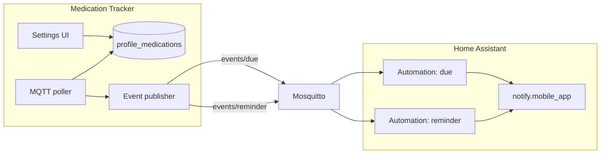

# MQTT edge events & notification preferences (v1.4)

Design reference for scalable Home Assistant notifications with per-profile, per-medication user preferences.

**Status:** Implemented in v1.4.0

---

## Goals

1. **Scale automatically** — new assigned meds work without editing HA automations.
2. **User control** — per profile + med: notify when due, optional early reminder.
3. **No notification spam** — fire on **transitions**, not every poll tick.
4. **Keep HA simple** — one or two MQTT-trigger automations reading JSON payloads.

## Non-goals (v1.4)

- Picking `notify.mobile_app_*` targets inside the app (HA automation handles routing).
- Push notifications from the app itself (still MQTT → HA → notify).
- MQTT `switch` entities for opt-in (app Settings is source of truth).
- Persisting edge-detection state across restarts (acceptable rare duplicate on restart; see below).

---

## Architecture



Discovery entities (`binary_sensor.*_due`, etc.) remain for dashboards. **Notifications** use dedicated event topics.

---

## Decisions (resolved)

| Question | Decision |
|----------|----------|
| Default `notify_when_due` | **Off** — explicit opt-in |
| Save UX | **Separate** Notifications section + dedicated API endpoint |
| MQTT poll interval | **30 seconds** (`MQTT_POLL_INTERVAL_MS` default `30000`) |
| HA Blueprint in repo | Follow-up after v1.4 ships |

---

## Database

**Migration:** `server/sql/003_profile_medication_notify.sql`

Add columns to `profile_medications`:

| Column | Type | Default | Meaning |
|--------|------|---------|---------|
| `notify_when_due` | `TINYINT(1)` | `0` | Publish `events/due` when dose becomes allowed |
| `notify_minutes_before` | `INT UNSIGNED NULL` | `NULL` | Early reminder N minutes before due; `NULL` = off |

```sql
ALTER TABLE profile_medications
  ADD COLUMN notify_when_due TINYINT(1) NOT NULL DEFAULT 0,
  ADD COLUMN notify_minutes_before INT UNSIGNED NULL DEFAULT NULL;
```

**Validation rules (server):**

- `notify_minutes_before` only meaningful when med has `interval_minutes`; ignore or reject if no interval.
- Allowed range: `1–1440` (1 min – 24 h), or `NULL`.
- Defaults on new assignment: both off (`notify_when_due = false`, `notify_minutes_before = NULL`).

---

## Fix assignment API (required)

Today `PUT /api/profiles/:id/medications` **deletes all rows and re-inserts**, which would wipe notify prefs on every “Save quick buttons”.

**Change to diff-based sync:**

```text
DELETE ... WHERE profile_id = ? AND medication_id NOT IN (assigned)
INSERT new rows only for newly assigned meds (with notify defaults)
-- existing rows for still-assigned meds are left untouched
```

Newly assigned meds get defaults; existing rows keep their notify settings.

---

## API

### Extend `GET /api/profiles/:id/medications`

Return notify fields on each assigned med:

```typescript
type ProfileMedication = MedStatus & {
  notify_when_due: boolean;
  notify_minutes_before: number | null;
};
```

### New `PUT /api/profiles/:id/medication-notifications`

Separate from quick-button assignment so the UI can save independently.

**Request:**

```json
{
  "settings": [
    {
      "medication_id": 3,
      "notify_when_due": true,
      "notify_minutes_before": 15
    }
  ]
}
```

**Behavior:**

- Only updates rows that exist in `profile_medications` (must be assigned).
- Validates `notify_minutes_before` against medication interval.
- Calls `refreshMqttState()` after save.

---

## Settings UI

New section below **Quick buttons**: **Notifications**

Same profile `<select>` as quick buttons (shared state).

For each **assigned** medication (not all meds in catalog):

| Control | Type | Notes |
|---------|------|-------|
| Notify when due | checkbox | Maps to `notify_when_due` |
| Remind before | number input + “min” label | Empty = off; disabled if med has no interval |

**UX details:**

- Show only meds assigned to selected profile (load from `getProfileMedications`).
- If med has no interval, show muted hint: “Early reminder requires an interval on the medication.”
- Save button: “Save notifications for {profile}”.

**Files:** `client/src/pages/SettingsPage.tsx`, `client/src/api.ts`, `client/src/index.css`.

---

## MQTT event topics

Prefix: `{mqtt_topic_prefix}/events/` (default `medication_tracker/events/`)

### `.../due` (non-retained)

Published when `can_take_now` transitions **false → true** and `notify_when_due` is true.

```json
{
  "event": "due",
  "profile_id": 1,
  "profile": "Josh",
  "medication_id": 3,
  "medication": "Ibuprofen",
  "taken_at_hint": null,
  "blocked_reason": null
}
```

### `.../reminder` (non-retained)

Published once per “waiting cycle” when:

- `notify_minutes_before` is set,
- med has an interval,
- `can_take_now` is false,
- `seconds_remaining <= notify_minutes_before * 60`,
- not already reminded this cycle.

```json
{
  "event": "reminder",
  "profile_id": 1,
  "profile": "Josh",
  "medication_id": 3,
  "medication": "Ibuprofen",
  "minutes_before": 15,
  "seconds_remaining": 842,
  "next_allowed_at": "2026-06-15T14:30:00.000Z"
}
```

**Do not retain** event messages (avoid replay on HA restart).

---

## Poller / publisher changes

**New module:** `server/src/mqtt/eventPublisher.ts`

**Poll interval:** default **30s** — update `config.ts`:

```typescript
pollIntervalMs: Number(process.env.MQTT_POLL_INTERVAL_MS ?? 30_000),
```

**In-memory state** (key: `p{profileId}_m{medId}`):

| Field | Purpose |
|-------|---------|
| `lastCanTakeNow` | Edge detect due |
| `reminderSent` | Dedup early reminder |
| `initialized` | Skip events on first sync after startup |

**Algorithm each poll** (after `gatherMqttStates()`):

```
for each assigned med with statuses:
  if !initialized:
    seed lastCanTakeNow, reminderSent; mark initialized; continue

  if notify_when_due && !lastCanTakeNow && can_take_now:
    publish events/due

  if notify_minutes_before && interval && !can_take_now:
    if seconds_remaining <= threshold && !reminderSent:
      publish events/reminder; reminderSent = true

  if can_take_now:
    reminderSent = false

  lastCanTakeNow = can_take_now
```

**Also reset `reminderSent` / update `lastCanTakeNow` immediately** in `refreshMqttState()` after dose log, edit, or delete (already called from dose routes).

**Extend `gatherMqttStates()`** to join notify columns from `profile_medications`.

**Startup:** first sync seeds state without publishing (prevents burst of “due” for meds already ready).

**Restart edge case:** if app restarts while med is still due, no false→true transition → no duplicate due event. If restart during reminder window, may re-send one reminder (acceptable for v1.4).

---

## Home Assistant automations

Document in `DOCS.md` when implemented.

### Due

```yaml
alias: Medication due
trigger:
  - trigger: mqtt
    topic: medication_tracker/events/due
action:
  - action: notify.mobile_app_josh_phone
    data:
      title: "Medication due"
      message: "{{ trigger.payload_json.profile }} — {{ trigger.payload_json.medication }}"
mode: single
```

### Early reminder

```yaml
alias: Medication reminder
trigger:
  - trigger: mqtt
    topic: medication_tracker/events/reminder
action:
  - action: notify.mobile_app_josh_phone
    data:
      title: "Medication reminder"
      message: >
        {{ trigger.payload_json.profile }} — {{ trigger.payload_json.medication }}
        in {{ (trigger.payload_json.seconds_remaining / 60) | round(0) }} minutes
mode: single
```

### Per-person routing (optional)

```yaml
choose:
  - conditions:
      - condition: template
        value_template: "{{ trigger.payload_json.profile_id == 1 }}"
    sequence:
      - action: notify.mobile_app_josh_phone
        ...
  - conditions:
      - condition: template
        value_template: "{{ trigger.payload_json.profile_id == 2 }}"
    sequence:
      - action: notify.mobile_app_partner_phone
        ...
```

**Future:** optional `profiles.ha_notify_target` column for app-driven routing.

---

## Files to touch

| Area | Files |
|------|-------|
| SQL | `server/sql/003_profile_medication_notify.sql` |
| DB types / queries | `server/src/dbTypes.ts`, `server/src/mqtt/gatherStates.ts`, `server/src/routes/profileMedications.ts` |
| API | New notification route; `server/src/index.ts` |
| MQTT | `server/src/mqtt/eventPublisher.ts`, `server/src/mqtt/poller.ts` |
| Config | `server/src/config.ts` (30s default poll) |
| Client | `client/src/api.ts`, `client/src/pages/SettingsPage.tsx`, `client/src/index.css` |
| Docs | `DOCS.md`, `CHANGELOG.md`, `README.md` |
| Version | `config.yaml`, `build.yaml` → **1.4.0** |

---

## Implementation order

1. Migration + fix assignment PUT (preserve notify columns).
2. API: GET extended fields + PUT medication-notifications.
3. Settings UI.
4. MQTT event publisher + poller integration (30s poll default).
5. Docs + example automations.
6. Deploy + git push.

---

## Testing checklist

- [ ] Assign med → defaults off; toggle notify → persists after re-saving quick buttons.
- [ ] Interval med becomes due → one `events/due` MQTT message.
- [ ] Stays due across polls → no repeat due events.
- [ ] Log dose → cycle resets; next due fires again after interval.
- [ ] `notify_minutes_before: 15` → one reminder ~15 min before; not again until next cycle.
- [ ] Med without interval → early reminder disabled in UI; no reminder events.
- [ ] `notify_when_due: false` → no due events (discovery entities unchanged).
- [ ] App restart while due → no spurious due event.
- [ ] HA automation receives payload and notifies.
- [ ] Poll runs every 30s by default (verify logs / event timing).
